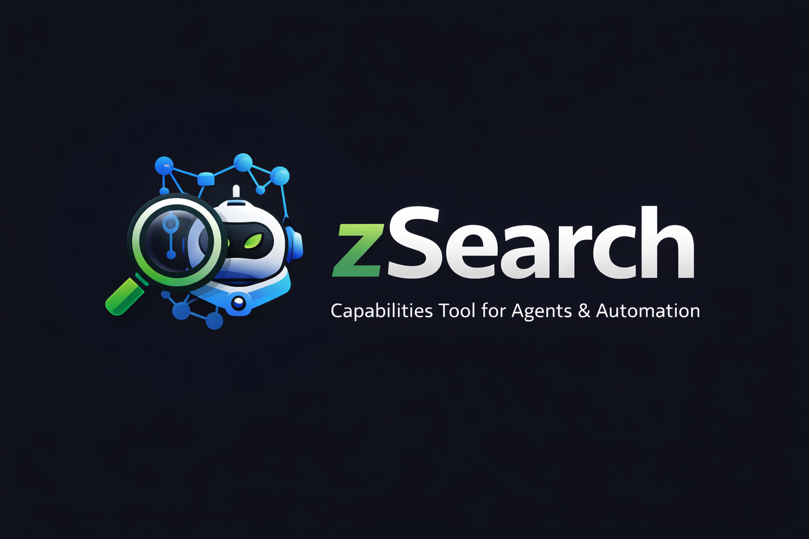

<p align="center">
  
</p>

# @brainwav/zsearch

Z.AI capabilities CLI and MCP server for agents and automation. Part of the **Search family**: `rSearch` (arXiv), `wSearch` (Wikidata), `zSearch` (Z.AI).

Access vision analysis, web search, web reading, GitHub repo exploration, AI code generation, chat — plus run as a **headless MCP server** for Claude Desktop, Cursor, and other AI apps.

## Installation

```bash
npm install -g @brainwav/zsearch
```

Or use directly with npx:

```bash
npx @brainwav/zsearch <command>
```

## Prerequisites

- **Node.js:** >=22.0.0 (Check with `node --version`)
- **npm:** Comes with Node.js
- **Z.AI API Key:** Required for all commands. See below for how to get one.

### Getting Your Z.AI API Key

You need a Z.AI API key to use this CLI. Here's how to get one:

1. Visit the [Z.AI Platform](https://z.ai)
2. Sign up or log in to your account
3. Navigate to Settings → API Keys
4. Create a new API key
5. Set the environment variable:

```bash
export Z_AI_API_KEY="your-api-key-here"

# Add to ~/.bashrc or ~/.zshrc for persistence
echo 'export Z_AI_API_KEY="your-api-key-here"' >> ~/.bashrc  # or ~/.zshrc
source ~/.bashrc  # or ~/.zshrc
```

## Quick Start

```bash
# Search the web
zsearch search "zsearch cli"

# Analyze an image
zsearch vision analyze screenshot.png "Describe this image"

# Read a web page
zsearch read https://example.com

# Explore a GitHub repo
zsearch repo tree facebook/react

# Chat with GLM-4
zsearch chat "Explain recursion in simple terms"

# Generate code
zsearch code run script.ts

# Health check
zsearch doctor
```

## Commands

### Vision
```bash
zsearch vision analyze <image> "<prompt>"    # General image analysis
zsearch vision ocr <image>                    # Extract text
zsearch vision ui-diff <before.png> <after>   # Compare UIs
zsearch vision video <video> "<prompt>"       # Analyze video
```

### Search
```bash
zsearch search "<query>" [--count <n>] [--language <code>] [--time-range <range>]
```

### Read
```bash
zsearch read <url> [--with-images-summary] [--no-gfm] [--retain-images]
```

### Repo
```bash
zsearch repo tree <owner/repo> [--path <dir>] [--depth <n>]
zsearch repo search <owner/repo> "<query>" [--language <code>]
```

**Note:** These commands connect to the Z.AI MCP server to access GitHub repository exploration capabilities via the ZRead tools.

### Chat & Code Generation
```bash
zsearch chat "<prompt>" [--model glm-4.7|glm-4.5-air] [--max-tokens <n>]
zsearch model "<prompt>"    # OpenAI-compatible chat completions
```

### Code Mode
```bash
zsearch code run <file.ts>       # Execute TypeScript chain
zsearch code eval "<expression>" # Evaluate expression
zsearch code interfaces          # List available interfaces
```

### MCP Tools
```bash
zsearch tools [--filter <text>] [--full] [--no-vision]
zsearch tool <name> [--no-vision]
zsearch call <tool> [--json <data> | --file <path> | --stdin] [--dry-run]
```

### Setup
```bash
zsearch setup              # Configure Z.AI for Claude Code
zsearch setup --list        # List current configuration
zsearch setup --unset      # Remove Z.AI configuration
```

### Diagnostics
```bash
zsearch doctor [--no-vision]
```

## MCP Server Mode

Run **zsearch as a headless MCP server** to expose Z.AI capabilities to Claude Desktop, Cursor, and other MCP-compatible applications:

```bash
zsearch mcp-server
```

### Available MCP Tools

| Tool | Description |
|------|-------------|
| `generate_code` | Generate code using GLM-4.7 or GLM-4.5-air |
| `chat` | General chat and assistance |

### Configuration for Claude Desktop

Add to your Claude Desktop config (`~/Library/Application Support/Claude/claude_desktop_config.json` on macOS):

```json
{
  "mcpServers": {
    "zsearch": {
      "command": "zsearch",
      "args": ["mcp-server"],
      "env": {
        "Z_AI_API_KEY": "your-api-key-here"
      }
    }
  }
}
```

### Configuration via CLI

```bash
claude mcp add -s user zsearch --env Z_AI_API_KEY="$Z_AI_API_KEY" -- zsearch mcp-server
```

### Verify MCP Server

```bash
# Check server status
claude mcp list

# Test directly
echo '{"jsonrpc":"2.0","id":1,"method":"tools/list"}' | zsearch mcp-server
```

## Backward Compatibility

The `zai-cli` command still works as an alias:

```bash
zai-cli search "query"  # Still works
zsearch search "query"  # New primary command
```

## Agent & Tool Integration

### For Claude Code, Codex, and Other Agents

**Direct CLI Invocation:**
Agents can invoke `zsearch` commands directly via their shell/bash tools:

```bash
# Web search
zsearch search "query" --json

# Web page reading
zsearch read "https://example.com" --json

# Vision analysis
zsearch vision analyze image.png "Describe this" --json

# GitHub repo exploration
zsearch repo tree owner/repo --json

# AI chat
zsearch chat "Explain this code" --json
```

**JSON Output Mode:**
Use `--json` for machine-readable output with stable schema:
```json
{
  "schema": "zsearch.search.v1",
  "meta": { "tool": "zsearch", "version": "0.1.0" },
  "status": "success",
  "data": [...]
}
```

### For Claude Code specifically

**Model Replacement Mode:**
Configure Claude Code to use Z.AI models instead of Anthropic:

```bash
# Set your API key
export Z_AI_API_KEY="your-api-key"

# Configure Claude Code
zsearch setup
```

This updates `~/.claude/settings.json` to redirect all Claude Code requests to Z.AI's Anthropic-compatible API endpoint. After restarting Claude Code, it will automatically use GLM-4.7 and GLM-4.5-air models.

**Two modes work together:**
1. **Model Replacement**: All Claude Code API calls use Z.AI models (GLM-4.7, GLM-4.5-air)
2. **MCP Server**: Claude Desktop can connect to `zsearch mcp-server` for additional tools
3. **CLI Access**: Claude Code can invoke `zsearch` directly for specialized capabilities

**To verify:**
1. Restart Claude Code (run `claude` again)
2. Run `/status` in Claude Code to see the configured models

**To remove:**
```bash
zsearch setup --unset
```

### For Codex specifically

**Environment Setup:**
Codex requires explicit environment variable configuration since it runs in its own environment:

```bash
# 1. Create the Codex environment file if it doesn't exist
mkdir -p ~/codex

# 2. Add your Z.AI API key
echo 'Z_AI_API_KEY="your-api-key"' > ~/codex/.env

# 3. Ensure Z_AI_API_KEY is in Codex's environment allowlist
# In ~/codex/config.toml, verify the allowlist includes:
# [agent]
# env_allowlist = ["Z_AI_API_KEY", ...]
```

**Why this is needed:**
- Codex executes commands in an isolated environment (`~/codex`)
- The `.env` file provides the API key value
- The `config.toml` allowlist explicitly permits `Z_AI_API_KEY` to be passed to subprocesses
- Without both, `zsearch` will fail with "Z_AI_API_KEY is required"

**To verify:**
```bash
# Check that the .env file exists and contains the key
cat ~/codex/.env

# Test that Codex can access zsearch
cd ~/codex && zsearch doctor
```

**Usage:**
Once configured, Codex can invoke all `zsearch` commands using the examples from the "Direct CLI Invocation" section above.

## Environment Variables

| Variable | Required | Default | Description |
|----------|----------|---------|-------------|
| `Z_AI_API_KEY` | Yes | - | Your Z.AI API key |
| `Z_AI_MODE` | No | `ZAI` | Platform mode |
| `Z_AI_TIMEOUT` | No | `30000` | Request timeout (ms) |
| `ZAI_MCP_TOOL_CACHE` | No | `1` | Enable tool discovery cache |
| `ZAI_MCP_TOOL_CACHE_TTL_MS` | No | `86400000` | Cache TTL (ms) |
| `ZAI_MCP_CACHE_DIR` | No | `~/.cache/zsearch` | Cache directory |
| `NO_COLOR` | No | - | Disable color output |

## Output Modes

### Default (Data-Only)
Token-efficient output for agent use:

```bash
$ zsearch search "zsearch cli"
[{"title": "...", "url": "...", "snippet": "..."}, ...]
```

### JSON Wrapped
Stable schema with metadata:

```bash
$ zsearch search "zsearch cli" --json
{
  "schema": "zsearch.search.v1",
  "meta": {
    "tool": "zsearch",
    "version": "0.1.0",
    "timestamp": "2025-01-05T...",
    "command": "search"
  },
  "status": "success",
  "data": [...],
  "errors": []
}
```

## The Search Family

| Tool | Command | Source | Purpose |
|------|---------|--------|---------|
| **rSearch** | `rsearch` | arXiv | Academic papers |
| **wSearch** | `wsearch` | Wikidata | Knowledge base |
| **zSearch** | `zsearch` | Z.AI | AI generation & search |

## Troubleshooting

### "Z_AI_API_KEY is required"
**Symptom:** Error message stating the API key is required.

**Solution:** Set the environment variable:
```bash
export Z_AI_API_KEY="your-api-key"

# For persistence, add to your shell profile:
echo 'export Z_AI_API_KEY="your-api-key"' >> ~/.bashrc  # or ~/.zshrc
source ~/.bashrc  # or ~/.zshrc
```

### "Node.js version too old"
**Symptom:** Installation or runtime fails due to Node.js version.

**Solution:** Upgrade to Node.js 22 or later. Using [nvm](https://github.com/nvm-sh/nvm):
```bash
nvm install 22
nvm use 22
nvm alias default 22  # Set as default
```

Verify with: `node --version` (should show v22.x.x or higher)

### "E_NETWORK: Connection timeout"
**Symptom:** Commands timeout after 30 seconds.

**Solutions:**
1. Check your internet connection
2. Verify Z.AI service status
3. Increase timeout:
```bash
zsearch --timeout 60000 vision analyze image.png "prompt"
```
Or set via environment:
```bash
export Z_AI_TIMEOUT=60000  # 60 seconds
```

### "E_AUTH: Authentication failure"
**Symptom:** API key rejected or invalid.

**Solutions:**
1. Verify your API key is correct:
```bash
echo $Z_AI_API_KEY  # Should show your key, not empty
```
2. Regenerate your API key from the Z.AI dashboard
3. Ensure the key has necessary permissions

### MCP server not connecting
**Symptom:** Claude Desktop can't connect to the MCP server.

**Solutions:**
1. Verify the server starts:
```bash
echo '{"jsonrpc":"2.0","id":1,"method":"tools/list"}' | zsearch mcp-server
```
2. Check Claude Desktop config for correct path and API key
3. Ensure Z_AI_API_KEY is set in the MCP server's environment

### Permission denied during global install
**Symptom:** `npm install -g` fails with permission error.

**Solutions:**
1. Use a Node version manager like [nvm](https://github.com/nvm-sh/nvm) or [volta](https://volta.sh/)
2. Or fix npm permissions (Linux/macOS):
```bash
mkdir -p ~/.npm-global
npm config set prefix '~/.npm-global'
echo 'export PATH=~/.npm-global/bin:$PATH' >> ~/.bashrc  # or ~/.zshrc
source ~/.bashrc  # or ~/.zshrc
```

### Cache issues
**Symptom:** Stale data or unexpected behavior.

**Solution:** Clear the cache:
```bash
rm -rf ~/.cache/zsearch
# Or if using custom cache dir:
rm -rf "$ZAI_MCP_CACHE_DIR"
```

## Exit Codes

| Code | Meaning |
|------|---------|
| 0 | Success |
| 1 | Generic failure |
| 2 | Invalid usage |
| 3 | Policy refusal |
| 4 | Partial success |
| 5 | Network failure |
| 6 | Authentication failure |
| 130 | User abort (Ctrl-C) |

## Security

For security policies, vulnerability reporting, and known issues, see [SECURITY.md](SECURITY.md).

**Known Vulnerability:** There is a known ReDoS vulnerability in the `@modelcontextprotocol/sdk` dependency (GHSA-8r9q-7v3j-jr4g). This has **low risk** for typical usage since the MCP server runs locally and only connects to trusted clients. See [SECURITY.md](SECURITY.md) for details.

## Contributing

We welcome contributions! Please see [CONTRIBUTING.md](CONTRIBUTING.md) for guidelines on development setup, testing, and the pull request process.

## License

MIT

---

**Looking for examples?** Check out the [examples/](examples/) directory for common usage patterns.
